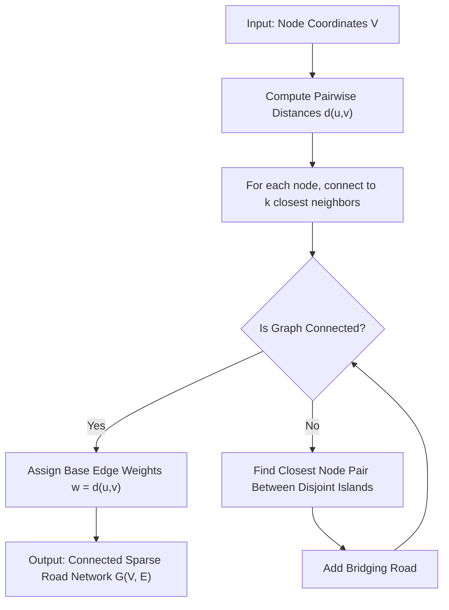

# 01. Sparse Road Network Construction ($k$-NN & Island Repair)

**Source File:** [`graph_model.py`](file:///c:/Users/Nivetha%20A/OneDrive/Documents/egreen-quanta/graph_model.py), [`cvrp_graph.py`](file:///c:/Users/Nivetha%20A/OneDrive/Documents/egreen-quanta/cvrp_graph.py)

---

## 1. Mathematical Formulation

Given a set of nodes (intersections or customer locations) $V = \{v_1, v_2, \dots, v_n\}$ with 2D Euclidean coordinates $\mathbf{x}_i = (x_i, y_i) \in \mathbb{R}^2$, the Euclidean distance between any pair $(v_i, v_j)$ is:

$$d(v_i, v_j) = \|\mathbf{x}_i - \mathbf{x}_j\|_2 = \sqrt{(x_i - x_j)^2 + (y_i - y_j)^2}$$

For each node $v_i$, let $\mathcal{N}_k(v_i) \subset V \setminus \{v_i\}$ be the set of its $k$-nearest neighbors under metric $d$. The initial directed edge set is:

$$E_{\text{raw}} = \{(v_i, v_j) \in V \times V : v_j \in \mathcal{N}_k(v_i)\}$$

To model bidirectional roads, edges are symmetrized:

$$E_{\text{sym}} = E_{\text{raw}} \cup \{(v_j, v_i) : (v_i, v_j) \in E_{\text{raw}}\}$$

### Connectivity Guarantee (Island Repair)
If the resulting graph $G = (V, E_{\text{sym}})$ contains $M > 1$ connected components $\{C_1, C_2, \dots, C_M\}$, bridge edges are added between disjoint components:

$$E = E_{\text{sym}} \cup \bigcup_{m=1}^{M-1} \{(u^*_m, v^*_m), (v^*_m, u^*_m)\}$$

where:

$$(u^*_m, v^*_m) = \arg\min_{u \in C_m, \, v \in C_{m+1}} d(u, v)$$

The unweighted base travel time / cost on edge $e = (u, v)$ is:

$$w_{\text{base}}(u, v) = d(u, v)$$

---

## 2. Intuition & Engineering Rationale

* **Why not a complete graph?** In physical road systems, vehicles cannot fly straight from any address to any other address. They must navigate a sparse mesh of streets and intersections.
* **Why Island Repair?** Small values of $k$ or clustered customer layouts can naturally yield disconnected "island" components. Without island reconnection, Dijkstra's algorithm would fail with infinite/unreachable distances, crashing route optimization.

---

## 3. Algorithmic Steps

1. **Calculate Distance Matrix:** Compute all-pairs Euclidean distances $D_{ij} = d(v_i, v_j)$.
2. **Assign $k$-NN Edges:** For each node $i$, sort distances and add undirected edges to the closest $k$ neighbors.
3. **Inspect Connected Components:** Identify disjoint subgraphs using breadth-first search or disjoint-set union.
4. **Bridge Disjoint Islands:** While components $M > 1$, add the minimum-distance edge between adjacent components.
5. **Assign Edge Weights:** Set base edge cost equal to Euclidean length.

---

## 4. Flowchart

---

## 5. Failure Modes & Edge Cases

* **$k$ too small ($k \le 2$):** Graph degenerates into a sparse tree with very few alternate paths, eliminating routing flexibility.
* **$k$ too large ($k \to n-1$):** Graph becomes dense/complete, degenerating into Euclidean flight and rendering intermediate road pathfinding redundant.
* **Overlapping / duplicate coordinates:** Yields zero distance edges; handled by requiring unique node locations.
