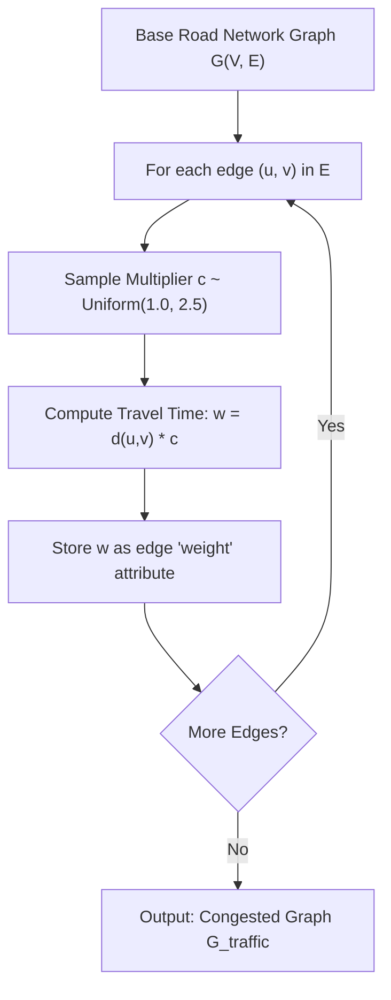

# 02. Stochastic Traffic Congestion Simulation

**Source File:** [`graph_model.py`](file:///c:/Users/Nivetha%20A/OneDrive/Documents/egreen-quanta/graph_model.py#L42-L52), [`cvrp_graph.py`](file:///c:/Users/Nivetha%20A/OneDrive/Documents/egreen-quanta/cvrp_graph.py#L48-L58)

---

## 1. Mathematical Formulation

Let $G = (V, E)$ be the road network graph with base geometric edge lengths $w_{\text{base}}(u, v) = d(u, v)$. 

Traffic congestion is modeled as a multiplicative random variable applied independently to each edge:

$$c(u, v) \sim \mathcal{U}(c_{\min}, c_{\max}) = \mathcal{U}(1.0, 2.5)$$

The effective travel time / cost on edge $(u, v)$ under live traffic is:

$$w_{\text{congested}}(u, v) = w_{\text{base}}(u, v) \times c(u, v)$$

For symmetric roads, $w_{\text{congested}}(u, v) = w_{\text{congested}}(v, u)$ per realization, or asymmetric traffic can be modeled by drawing directional multipliers.

---

## 2. Intuition & Concept

* **Dynamic Road Realities:** In urban logistics, physical distance does not equal transit time. A shorter road choked with heavy traffic ($c=2.5$) can take longer to traverse than a longer expressway with free-flowing traffic ($c=1.0$).
* **Stochastic Evaluation:** Every benchmark seed generates a distinct traffic snapshot. Algorithms cannot overfit to fixed geometric layouts; they must find optimal paths under non-uniform edge weights.

---

## 3. Algorithmic Steps

1. Iterate over every undirected edge $\{u, v\} \in E$.
2. Sample a random uniform multiplier $c \sim \mathcal{U}(1.0, 2.5)$.
3. Compute the congested travel time $w = d(u, v) \times c$.
4. Store $w$ in the graph edge attribute `weight`.
5. Return the congested graph $G_{\text{traffic}}$.

---

## 4. Flowchart

---

## 5. Failure Modes & Edge Cases

* **Multiplier $\le 0$:** Negative edge weights would break Dijkstra's algorithm (producing invalid cycles or failure); guaranteed positive with $c \ge 1.0$.
* **Identical traffic everywhere ($c(u, v) \equiv 1$):** Degenerates the problem to purely static Euclidean distance, stripping out traffic optimization dynamics.
