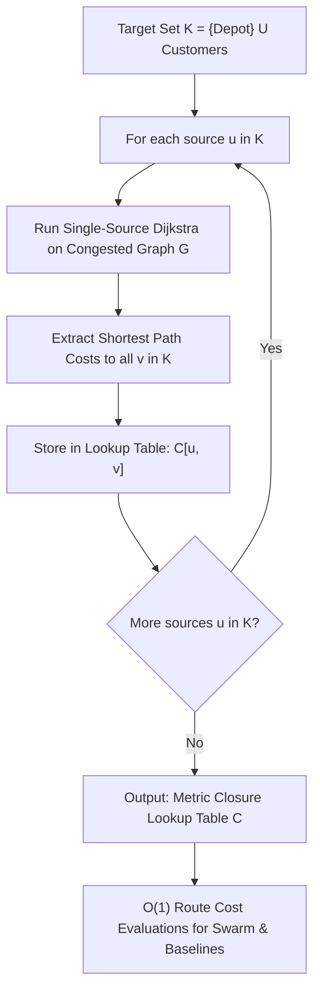

# 03. Dijkstra's Shortest Path & Segment Cost Precomputation

**Source File:** [`baseline.py`](file:///c:/Users/Nivetha%20A/OneDrive/Documents/egreen-quanta/baseline.py#L11-L18), [`qpso.py`](file:///c:/Users/Nivetha%20A/OneDrive/Documents/egreen-quanta/qpso.py#L28-L35)

---

## 1. Mathematical Formulation

Given a congested directed graph $G = (V, E)$ with non-negative edge weights $w: E \to \mathbb{R}^+$, the shortest path distance between source $s$ and target $t$ is:

$$\text{dist}(s, t) = \min_{p \in \mathcal{P}_{s \to t}} \sum_{(u, v) \in p} w(u, v)$$

where $\mathcal{P}_{s \to t}$ is the set of all directed paths from $s$ to $t$ in $G$.

### All-Pairs Segment Cost Matrix
In delivery routing, we only care about transitions between the depot and active delivery stops $K = \{0\} \cup \text{Waypoints}$.

We precompute the complete $|K| \times |K|$ metric closure lookup:

$$\mathbf{C}_{u, v} = \text{DijkstraShortestPathCost}(G, u, v) \quad \forall u, v \in K$$

---

## 2. Intuition & Performance Optimization

* **Why exact pathfinding?** While routing orders are combinatorial permutations, physical travel between consecutive stops follows roads. Dijkstra guarantees the exact minimal travel time along the road network.
* **Why Precompute?** During metaheuristic search (e.g. QPSO evaluating 30 particles across 100 iterations = 3,000 evaluations), evaluating route cost repeatedly would require 30,000+ Dijkstra queries on the full graph. Precomputing $|K|$ single-source shortest path trees reduces every transition cost lookup during optimization to $\mathcal{O}(1)$ hash/array access.

---

## 3. Algorithmic Steps

1. For each node $u \in K$:
   a. Initialize priority queue with $(0, u)$ and tentative distance vector $d[v] = \infty$, $d[u] = 0$.
   b. Pop minimum tentative distance node $x$.
   c. Relax all outgoing edges $(x, y) \in E$: if $d[x] + w(x, y) < d[y]$, update $d[y] = d[x] + w(x, y)$ and push to queue.
   d. Extract shortest distances to all target nodes $v \in K$ and populate table $\mathbf{C}_{u, v}$.
2. Store table $\mathbf{C}$ as a fast lookup dictionary `seg_costs[(u, v)]`.

---

## 4. Flowchart

---

## 5. Failure Modes & Edge Cases

* **Disconnected nodes:** If graph connectivity repair failed, $d[v] = \infty$.
* **Negative weights:** Dijkstra assumes $w \ge 0$; assured by $w_{\text{base}} > 0$ and congestion factor $c \ge 1.0$.
