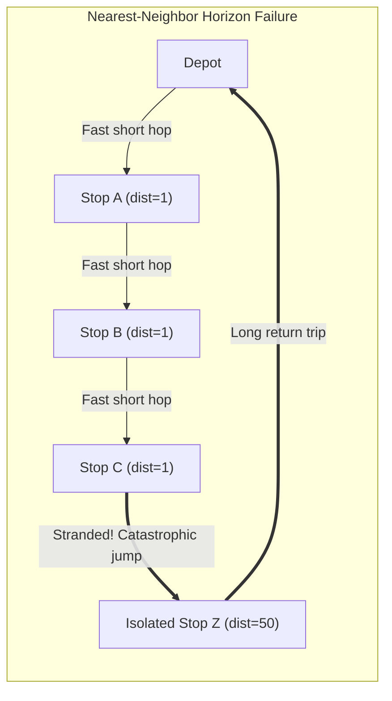
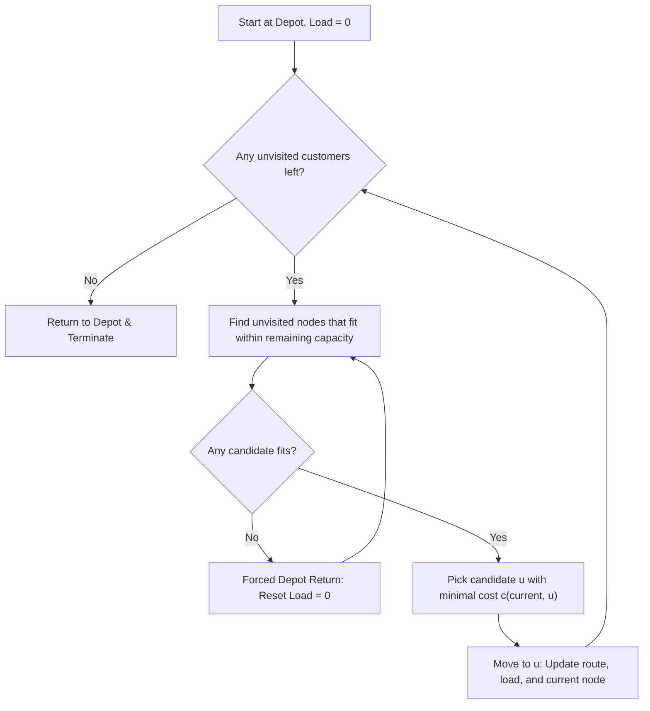

# 04. Nearest-Neighbor (NN) Greedy Heuristic

**Source File:** [`baseline.py`](file:///c:/Users/Nivetha%20A/OneDrive/Documents/egreen-quanta/baseline.py#L20-L39), [`cvrp_baseline.py`](file:///c:/Users/Nivetha%20A/OneDrive/Documents/egreen-quanta/cvrp_baseline.py#L18-L63)

---

## 1. Mathematical Formulation

Let $V_{\text{unvisited}}$ be the set of delivery locations currently pending visit. Starting from the depot $v_0$, the next location $v_{t+1}$ is chosen by a purely greedy myopic step:

$$v_{t+1} = \arg\min_{u \in V_{\text{unvisited}}} c(v_t, u)$$

subject to capacity feasibility in CVRP:

$$\text{load}_t + d_u \le C$$

If no unvisited customer satisfies the capacity constraint, the vehicle returns to the depot:

$$v_{t+1} = \text{depot}, \quad \text{load}_{t+1} = 0$$

and the search resumes from the depot.

---

## 2. Intuition & Failure Modes

* **Concept:** Always take the shortest available jump from the current position.
* **Why it fails (The Greedy Trap):** Nearest-Neighbor has zero planning horizon. It opportunistically grabs close stops early on, inevitably stranding the vehicle far away from the remaining stops. The final leg or return trip often incurs an enormous, catastrophic penalty across the entire map.

---

## 3. Algorithmic Steps

1. Start at `current = depot`, `route = [depot]`, `load = 0`.
2. Find all unvisited nodes $u$ where `load + demand[u] <= capacity`.
3. If no candidate fits:
   - Append `depot` to route, reset `load = 0`, `current = depot`.
   - Re-evaluate candidate set.
4. Select $u^* = \arg\min_u c(\text{current}, u)$.
5. Append $u^*$ to route, update `load += demand[u*]`, remove $u^*$ from remaining.
6. Repeat until all customers are visited, then return to depot.

---

## 4. Flowchart

---

## 5. Summary Characteristics

* **Time Complexity:** $\mathcal{O}(n^2)$.
* **Strengths:** Blazingly fast, simple to implement.
* **Weaknesses:** Highly sensitive to starting depot position; regularly gets stuck in local greedy traps.
