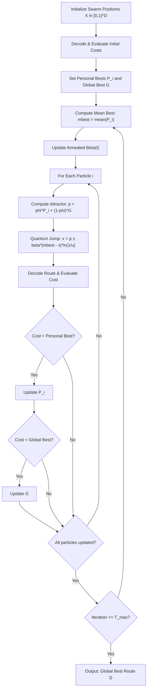

# 05. Quantum-behaved Particle Swarm Optimization (QPSO)

**Source File:** [`qpso.py`](file:///c:/Users/Nivetha%20A/OneDrive/Documents/egreen-quanta/qpso.py), [`cvrp_qpso.py`](file:///c:/Users/Nivetha%20A/OneDrive/Documents/egreen-quanta/cvrp_qpso.py)

**Reference:** Sun, J., Feng, B., & Xu, W. (2004). *Particle swarm optimization with particles having quantum behavior*. IEEE Congress on Evolutionary Computation.

---

## 1. Mathematical Formulation

In classical PSO, particles follow Newtonian mechanics using position $\mathbf{x}_i$ and velocity $\mathbf{v}_i$.

In **QPSO**, velocity is discarded entirely. Particles are assumed to move in a multidimensional **quantum delta-potential well** centered at a local attractor point $\mathbf{p}_i$.

### Core Equations

#### 1. Mean Best Position ($m_{\text{best}}$)
The centroid of all particles' historical personal-best positions:

$$m_{\text{best}}(t) = \frac{1}{M} \sum_{i=1}^M \mathbf{P}_i(t)$$

where $M$ is the swarm size and $\mathbf{P}_i$ is particle $i$'s personal best.

#### 2. Local Attractor ($\mathbf{p}_i$)
A stochastic linear interpolation between personal best $\mathbf{P}_i$ and global swarm best $\mathbf{G}$:

$$\mathbf{p}_i(t) = \phi_i \odot \mathbf{P}_i(t) + (1 - \phi_i) \odot \mathbf{G}(t), \quad \phi_i \sim \mathcal{U}(0, 1)^D$$

#### 3. Quantum State Wavefunction Collapse (Position Update)
Solving the Schrödinger equation for a particle in a delta potential well yields an exponential wave function. Sampling from the resulting probability distribution yields:

$$\mathbf{x}_i(t+1) = \mathbf{p}_i(t) \pm \beta(t) \odot |m_{\text{best}}(t) - \mathbf{x}_i(t)| \odot \ln\left(\frac{1}{\mathbf{u}_i}\right)$$

where:
* $\mathbf{u}_i \sim \mathcal{U}(0, 1)^D$ (drawn coordinate-wise),
* $\pm$ sign is chosen with probability $0.5$ per dimension,
* $\beta(t)$ is the **contraction-expansion coefficient**, annealed linearly over generations:

$$\beta(t) = \beta_{\max} - \frac{t}{T_{\max}} (\beta_{\max} - \beta_{\min})$$

Typically $\beta_{\max} = 1.0$ (strong quantum exploration) and $\beta_{\min} = 0.4$ (precise convergence).

---

## 2. Intuition: Why Quantum Behavior Outperforms Classical Swarms

1. **Global Reachability:** Because the probability density has exponential tails, a particle can theoretically appear anywhere in search space in a single iteration—enabling it to tunnel out of steep local minima.
2. **No Velocity Clipping:** Classical PSO requires tuning momentum $\omega$, acceleration constants $c_1, c_2$, and maximum velocity $v_{\max}$. QPSO has only a single control parameter ($\beta$), making convergence far more robust.

---

## 3. Algorithmic Steps

1. **Initialize Swarm:** Generate $M$ particles uniformly in $[0, 1]^D$.
2. **Evaluate Fitness:** Decode each particle into a route using Priority Encoding and compute cost with Dijkstra lookup.
3. **Initialize Memory:** Set $\mathbf{P}_i = \mathbf{x}_i$ and $\mathbf{G} = \arg\min_{\mathbf{P}_i} \text{Cost}(\mathbf{P}_i)$.
4. **Iterative Search ($t = 1 \to T_{\max}$):**
   a. Compute mean best position $m_{\text{best}}$.
   b. Update contraction coefficient $\beta(t)$.
   c. For each particle $i$:
      - Sample local attractor $\mathbf{p}_i$.
      - Compute position step with logarithmic delta-potential update.
      - Decode and score new position.
      - Update personal best $\mathbf{P}_i$ and swarm best $\mathbf{G}$ if cost improved.
5. **Return:** Optimal route and convergence trajectory.

---

## 4. Flowchart

