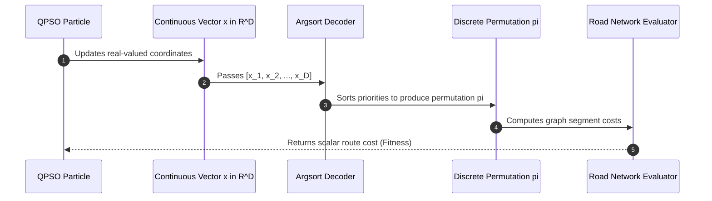

# 06. Priority-Based Permutation Encoding (Random Keys)

**Source File:** [`qpso.py`](file:///c:/Users/Nivetha%20A/OneDrive/Documents/egreen-quanta/qpso.py#L9-L11), [`cvrp_qpso.py`](file:///c:/Users/Nivetha%20A/OneDrive/Documents/egreen-quanta/cvrp_qpso.py#L14-L16)

---

## 1. Mathematical Formulation

QPSO operates naturally over continuous vector spaces $\mathbf{x} \in \mathbb{R}^D$. Vehicle routing, however, requires finding an optimal permutation $\pi \in S_D$ of discrete stops.

Let $\mathbf{x} = [x_1, x_2, \dots, x_D] \in \mathbb{R}^D$ be a particle's continuous position vector. The discrete permutation $\pi$ is obtained via the **argsort** sorting operator:

$$\pi = \text{argsort}(\mathbf{x}) \implies \mathbf{x}_{\pi(1)} \le \mathbf{x}_{\pi(2)} \le \dots \le \mathbf{x}_{\pi(D)}$$

Visiting order is directly given by:

$$\text{Route} = [\text{Stop}_{\pi(1)}, \text{Stop}_{\pi(2)}, \dots, \text{Stop}_{\pi(D)}]$$

---

## 2. Intuition & Theoretical Guarantee

* **No Infeasible Permutations:** Unlike direct integer encoding where crossover or arithmetic vector updates create invalid tours (duplicate nodes or omitted stops requiring complex repair heuristics), sorting continuous numbers **always** yields a valid, bijection permutation of stops.
* **Continuous Landscape Mapping:** Small continuous nudges in $\mathbf{x}$ preserve ordering, while larger continuous updates seamlessly flip adjacent elements, enabling gradient-free continuous metaheuristics to search discrete combinatorial spaces.

---

## 3. Concrete Example

Suppose we have 4 customer stops: `[C1, C2, C3, C4]`.

1. **Continuous Position:** $\mathbf{x} = [0.82, 0.15, 0.94, 0.47]$
2. **Sort Indices (`argsort`):**
   * Smallest value is $0.15$ (Index 1 $\to$ `C2`)
   * Next is $0.47$ (Index 3 $\to$ `C4`)
   * Next is $0.82$ (Index 0 $\to$ `C1`)
   * Largest is $0.94$ (Index 2 $\to$ `C3`)
3. **Decoded Route:** `[Depot, C2, C4, C1, C3, Depot]`

---

## 4. Sequence Diagram

---

## 5. Edge Cases

* **Ties in floating-point priorities:** If $x_i = x_j$, `numpy.argsort` breaks ties deterministically using lower index, preserving validity.
