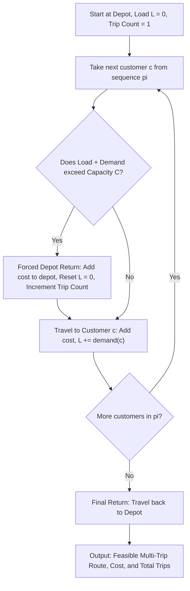

# 07. Multi-Trip Capacity Constraint Handling

**Source File:** [`cvrp_qpso.py`](file:///c:/Users/Nivetha%20A/OneDrive/Documents/egreen-quanta/cvrp_qpso.py#L28-L62), [`cvrp_baseline.py`](file:///c:/Users/Nivetha%20A/OneDrive/Documents/egreen-quanta/cvrp_baseline.py#L35-L46)

---

## 1. Mathematical Formulation

In Capacitated Vehicle Routing Problems (CVRP), each customer $i \in V \setminus \{0\}$ has a cargo demand $d_i > 0$, and the vehicle has a maximum payload capacity $C$.

Let $\pi = (\pi_1, \pi_2, \dots, \pi_n)$ be a suggested customer visitation order.

A single continuous tour is decomposed into multiple feasible trips $(T_1, T_2, \dots, T_m)$ departing from and returning to depot $v_0$:

$$\sum_{j \in T_k} d_j \le C \quad \forall k \in \{1, \dots, m\}$$

### Dynamic Multi-Trip Insertion Logic
Initialize current load $L = 0$, current position $u = v_0$, total cost $W = 0$, trip count $m = 1$.

For each requested customer $c \in \pi$:

$$\text{If } L + d_c > C: \quad \begin{cases} W \leftarrow W + \mathbf{C}_{u, v_0} & \text{(Forced return to depot)} \\ u \leftarrow v_0 & \\ L \leftarrow 0 & \text{(Payload reloaded)} \\ m \leftarrow m + 1 & \text{(New trip initiated)} \end{cases}$$

Then proceed to deliver:

$$\begin{cases} W \leftarrow W + \mathbf{C}_{u, c} \\ u \leftarrow c \\ L \leftarrow L + d_c \end{cases}$$

Upon visiting all customers, execute final return:

$$W \leftarrow W + \mathbf{C}_{u, v_0}$$

---

## 2. Intuition & Optimization Leverage

* **Why not discard infeasible routes with infinite penalty?** Rejecting routes outright destroys the continuity of the search space, causing swarm algorithms to stall.
* **Why Multi-Trip is smarter:** The number and placement of forced depot returns directly depends on the **order** of customer visits. Clustering customers that collectively sum to $\le C$ eliminates costly backtrack trips to the depot.

---

## 3. Flowchart

