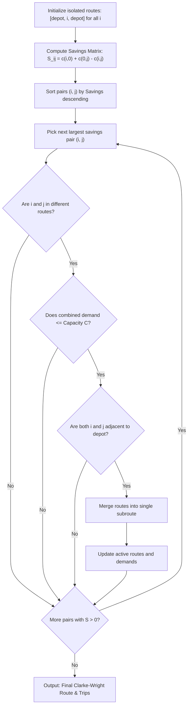

# 08. Clarke-Wright Savings Algorithm

**Source File:** [`clarke_wright.py`](file:///c:/Users/Nivetha%20A/OneDrive/Documents/egreen-quanta/clarke_wright.py)

**Reference:** Clarke, G., & Wright, J. W. (1964). *Scheduling of vehicles from a central depot to a number of delivery points*. Operations Research, 12(4), 568-581.

---

## 1. Mathematical Formulation

Let depot be $v_0$, and customers be $V_C = \{1, 2, \dots, n\}$.

Initially, every customer is served via an independent back-and-forth round trip:

$$T_i = (v_0 \to i \to v_0), \quad \text{Cost}_0 = \sum_{i \in V_C} \left( c(v_0, i) + c(i, v_0) \right)$$

If two separate trips $(v_0 \to \dots \to i \to v_0)$ and $(v_0 \to j \to \dots \to v_0)$ are merged into a single linked trip $(v_0 \to \dots \to i \to j \to \dots \to v_0)$, the depot-return edge $(i, v_0)$ and departure edge $(v_0, j)$ are eliminated and replaced by direct inter-customer edge $(i, j)$.

The resulting **Savings** $S_{ij}$ is:

$$S_{ij} = c(i, v_0) + c(v_0, j) - c(i, j)$$

```
     Separate Trips                  Merged Trip
      v_0           v_0                 v_0
     /   \         /   \               /   \
    /     \       /     \             /     \
   i       i     j       j           i ----> j
  Cost: c(0,i)+c(i,0)+c(0,j)+c(j,0)   Cost: c(0,i)+c(i,j)+c(j,0)
                       Savings = c(i,0) + c(0,j) - c(i,j)
```

---

## 2. Merge Validity Criteria

A customer pair $(i, j)$ with $S_{ij} > 0$ can be merged if and only if:

1. **Different Routes:** Customers $i$ and $j$ reside in distinct active subroutes $R_a$ and $R_b$.
2. **Endpoint Adjacency:** Both $i$ and $j$ are adjacent to the depot in their respective subroutes (interior nodes cannot be merged without violating vehicle path topology).
3. **Capacity Feasibility:** Combined route demand does not exceed vehicle capacity:

$$\sum_{u \in R_a} d_u + \sum_{v \in R_b} d_v \le C$$

---

## 3. Algorithmic Steps

1. **Initialize Base Tours:** Create individual routes $R_i = [v_0, i, v_0]$ for each customer $i$.
2. **Compute Savings Matrix:** Calculate $S_{ij} = c(i, v_0) + c(v_0, j) - c(i, j)$ for all pairs $i \neq j$.
3. **Sort Savings:** Sort list of tuples $(S_{ij}, i, j)$ in descending order.
4. **Greedy Merging:**
   For each candidate $(S_{ij}, i, j)$:
   - Check if $S_{ij} \le 0$ (terminate if no positive savings remain).
   - If $i$ and $j$ are already in the same route, continue.
   - If merged demand $> C$, continue.
   - If both $i$ and $j$ are exterior endpoints, join the two routes and update active route tracking.
5. **Assemble Route:** Concatenate all resulting subroutes into the final multi-trip schedule.

---

## 4. Flowchart



---

## 5. Why Clarke-Wright is the Industry Standard

* **Structural Superiority over Nearest-Neighbor:** While NN chooses stops purely based on current proximity, Clarke-Wright evaluates the global opportunity cost of not combining customer pairs.
* **Direct Multi-Trip Modeling:** Naturally generates compact clusters of trips without needing artificial patch-ups or repair rules.
