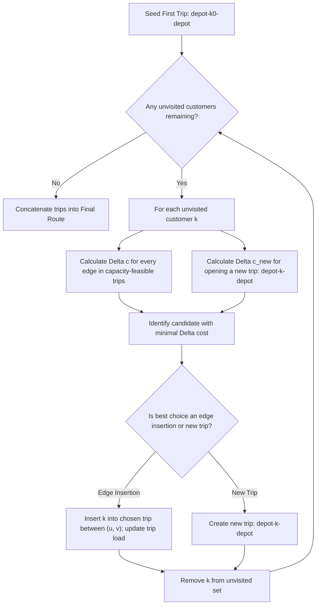

# 09. Cheapest Insertion Heuristic

**Source File:** [`cheapest_insertion.py`](file:///c:/Users/Nivetha%20A/OneDrive/Documents/egreen-quanta/cheapest_insertion.py)

---

## 1. Mathematical Formulation

Let the current partial tour be an ordered sequence of nodes $T = (u_1, u_2, \dots, u_m, u_1)$.

For any unvisited customer node $k \notin T$ and any active tour edge $(u_p, u_{p+1}) \in T$, the incremental insertion cost $\Delta c(u_p, k, u_{p+1})$ incurred by inserting $k$ between $u_p$ and $u_{p+1}$ is:

$$\Delta c(u_p, k, u_{p+1}) = c(u_p, k) + c(k, u_{p+1}) - c(u_p, u_{p+1})$$

```
      Before Insertion                After Insertion
           u_p                            u_p
            |                              \
            | c(u_p, u_{p+1})               \ c(u_p, k)
            v                                v
         u_{p+1}                             k
                                            /
                                           / c(k, u_{p+1})
                                          v
                                       u_{p+1}
       Delta Cost = c(u_p, k) + c(k, u_{p+1}) - c(u_p, u_{p+1})
```

### Selection Criterion
At each step, find the customer $k^*$ and edge $(u_p^*, u_{p+1}^*)$ that achieves the minimum detour:

$$(k^*, p^*) = \arg\min_{k \in V_{\text{unvisited}}, \, p} \Delta c(u_p, k, u_{p+1})$$

---

## 2. CVRP Extension (Multi-Trip Handling)

When applying Cheapest Insertion to CVRP with vehicle capacity $C$:

1. Insertion is only evaluated for edges in trips where:

$$\text{Load}(T) + d_k \le C$$

2. In addition to inserting into existing trips, the algorithm simultaneously evaluates **initiating a new trip** $(v_0 \to k \to v_0)$ with incremental cost:

$$\Delta c_{\text{new}}(k) = c(v_0, k) + c(k, v_0)$$

3. The candidate that minimizes overall cost across both existing trip insertions and new trip openings is selected.

---

## 3. Algorithmic Steps

1. **Seed Initial Trip:** Pick the customer with minimal round-trip cost to depot: $T_1 = [v_0, k_0, v_0]$.
2. **Loop Until All Customers Visited:**
   a. For every remaining unvisited customer $k$:
      - Evaluate insertion cost $\Delta c$ across all edges of existing trips that have remaining capacity $\ge d_k$.
      - Evaluate cost $\Delta c_{\text{new}}$ of opening a fresh trip $[v_0, k, v_0]$.
   b. Identify the global minimum $(k^*, \text{action})$.
   c. Execute the insertion or append the new trip.
   d. Remove $k^*$ from unvisited pool.
3. **Assemble Final Route:** Concatenate all subroutes into the comprehensive delivery tour.

---

## 4. Flowchart



---

## 5. Why Cheapest Insertion Differentiates from Nearest-Neighbor

| Attribute | Nearest-Neighbor | Cheapest Insertion |
|---|---|---|
| **Insertion Location** | Only at the end of the route | Anywhere along existing tour edges |
| **Failure Mode** | Strands vehicle far away on final stops | May create crossed edges in dense clusters |
| **Sensitivity to Start** | Extremely high | Lower (evaluates all edges globally) |
| **Greedy Philosophy** | "Where do I go next from here?" | "Where does this stop fit with minimum detour?" |
