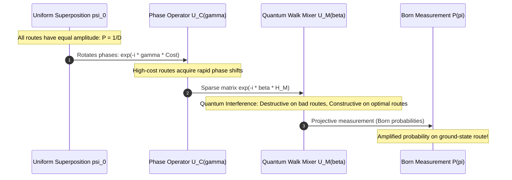
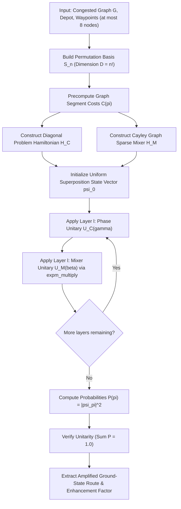

# 10. Quantum Walk Optimization Algorithm (QWOA — State-Vector Simulation)

**Source File:** [`qwoa.py`](file:///c:/Users/Nivetha%20A/OneDrive/Documents/egreen-quanta/qwoa.py)

**References:**
* Marsh, S., & Wang, J. B. (2020). *A quantum walk-assisted algorithm for bounded NP-complete problems*. Quantum Information Processing.
* Hadfield, S., et al. (2019). *From the Quantum Approximate Optimization Algorithm to a Quantum Alternating Operator Ansatz*. Algorithms, 12(2), 34.

---

## 1. Mathematical Formulation

Unlike QPSO (which is a **classical metaheuristic inspired by quantum mechanics** running on ordinary numbers), **QWOA** is a **genuine quantum algorithm** whose full state-vector wavefunction $|\psi(t)\rangle$ is simulated classically via exact unitary propagation in complex Hilbert space $\mathbb{C}^D$.

### Permutation Hilbert Space $\mathcal{H}_{S_n}$
To avoid the exponential qubit penalty of binary formulations ($N^2$ qubits requiring $2^{N^2}$ amplitudes), QWOA is formulated directly on the subspace spanned by valid permutations $S_n$:

$$\mathcal{H}_{S_n} = \text{span}\left\{ |\pi\rangle : \pi \in S_n \right\}, \quad \dim(\mathcal{H}_{S_n}) = n!$$

Every basis state $|\pi\rangle$ is inherently a valid permutation. No invalid tours or subtours can ever exist.

### 1. Initial State: Uniform Quantum Superposition
The quantum state starts in an equal superposition of all $n!$ possible visiting orders:

$$|\psi_0\rangle = \frac{1}{\sqrt{n!}} \sum_{\pi \in S_n} |\pi\rangle$$

The classical probability of measuring any route at $t=0$ is uniformly flat:

$$P_0(\pi) = |\langle \pi | \psi_0 \rangle|^2 = \frac{1}{n!}$$

### 2. Problem / Cost Hamiltonian ($H_C$)
$H_C$ encodes the graph-routed travel cost $C(\pi)$ as a diagonal operator:

$$H_C |\pi\rangle = C(\pi) |\pi\rangle, \quad H_C = \sum_{\pi \in S_n} C(\pi) |\pi\rangle \langle \pi|$$

The phase separation unitary operator $U_C(\gamma)$ rotates the quantum phase of each basis state proportionally to its travel cost:

$$U_C(\gamma) = e^{-i \gamma H_C} \implies U_C(\gamma) |\pi\rangle = e^{-i \gamma C(\pi)} |\pi\rangle$$

### 3. Mixer / Quantum Walk Hamiltonian ($H_M$)
$H_M$ generates continuous-time quantum transitions between permutations that differ by elementary transpositions (adjacent customer swaps):

$$H_M = \sum_{\pi \in S_n} \sum_{\tau \in \text{Transpositions}} |\tau \cdot \pi\rangle \langle \pi|$$

$H_M$ is a real symmetric, sparse adjacency matrix of the Cayley graph of $S_n$. The quantum walk unitary $U_M(\beta)$ drives interference across configurations:

$$U_M(\beta) = e^{-i \beta H_M}$$

### 4. Quantum Evolution Ansatz ($p$ Layers)
Applying alternating unitary operations drives constructive interference towards the ground state (lowest-cost route):

$$|\psi(\boldsymbol{\gamma}, \boldsymbol{\beta})\rangle = \left( \prod_{l=1}^p U_M(\beta_l) U_C(\gamma_l) \right) |\psi_0\rangle$$

### 5. Born Rule & Measurement
Upon projective measurement in the computational basis:

$$P(\pi) = |\langle \pi | \psi \rangle|^2 = |\psi_\pi|^2, \quad \sum_{\pi \in S_n} P(\pi) = 1.0$$

The expected route cost is given by the quantum expectation value:

$$\langle H_C \rangle = \langle \psi | H_C | \psi \rangle = \sum_{\pi \in S_n} P(\pi) C(\pi)$$

---

## 2. Dimensionality & Simulation Boundary

| Waypoints ($n$) | State Space Dimension ($n!$) | Memory / Vector Size | Simulation Time (CPU) |
|---|---|---|---|
| 4 | 24 | ~384 bytes | < 5 ms |
| 5 | 120 | ~1.9 KB | ~ 15 ms |
| 6 | 720 | ~11.5 KB | ~ 40 ms |
| 7 | 5,040 | ~80 KB | ~ 250 ms |
| 8 | 40,320 | ~640 KB | ~ 2.1 s |
| 9 | 362,880 | ~5.8 MB | ~ 25 s |

> [!NOTE]
> To ensure instantaneous interactivity and exact numerical stability, QWOA is scoped to small-scale demonstrations ($\le 8$ nodes). It serves as a scientific proof-of-concept demonstrating genuine quantum state-vector simulation alongside classical metaheuristics.

---

## 3. Quantum Interference Visualization

---

## 4. Flowchart

