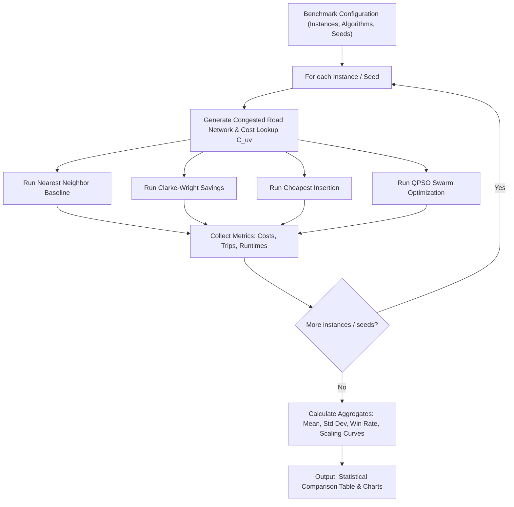

# 11. Benchmarking & Statistical Evaluation Methodologies

**Source File:** [`benchmark.py`](file:///c:/Users/Nivetha%20A/OneDrive/Documents/egreen-quanta/benchmark.py), [`cvrp_benchmark.py`](file:///c:/Users/Nivetha%20A/OneDrive/Documents/egreen-quanta/cvrp_benchmark.py)

---

## 1. Benchmarking Philosophy

A single optimization run on a single random graph can be misleading due to lucky or unlucky initialization seeds. To provide statistically rigorous claims for SIH 2026, the evaluation framework implements three rigorous benchmark methodologies:

```
                          ┌────────────────────────┐
                          │ Benchmarking Suite     │
                          └──────────┬─────────────┘
          ┌──────────────────────────┼──────────────────────────┐
          │                          │                          │
          ▼                          ▼                          ▼
┌───────────────────┐      ┌───────────────────┐      ┌───────────────────┐
│ 1. Multi-Seed     │      │ 2. Scalability    │      │ 3. Multi-Instance │
│    Evaluation     │      │    Sweep          │      │    Evaluation     │
│  (Fixed Size,     │      │  (Sweep N Nodes,  │      │  (Pre-built Real  │
│   Vary Traffic)   │      │   Measure Scaling)│      │   CVRP instances) │
└───────────────────┘      └───────────────────┘      └───────────────────┘
```

---

## 2. Methodology 1: Multi-Seed Benchmark (Phase 1)

* **Question Answered:** *Is the algorithm's performance improvement consistent, or merely an artifact of a single lucky random seed?*
* **Procedure:**
  1. Fix problem dimension ($N = 20$ nodes, $K = 5$ delivery waypoints).
  2. Execute $S = 20$ distinct trials with random seeds $s \in \{1, \dots, 20\}$.
  3. For each trial, instantiate a new random road topology and congestion snapshot.
  4. Compute Percentage Improvement over baseline:

$$\text{Imp}_s = \frac{\text{Cost}_{\text{Baseline}} - \text{Cost}_{\text{Candidate}}}{\text{Cost}_{\text{Baseline}}} \times 100\%$$

  5. Compute aggregate metrics: Mean Improvement ($\mu$), Sample Standard Deviation ($\sigma$), and Win Rate ($W = \sum \mathbb{I}(\text{Cost}_{\text{Candidate}} \le \text{Cost}_{\text{Baseline}})$).

---

## 3. Methodology 2: Scalability Sweep (Phase 1)

* **Question Answered:** *How does computational complexity and solution quality scale as problem size grows?*
* **Procedure:**
  1. Vary graph size across a geometric progression: $N \in \{10, 20, 30, 40, 50, 75, 100\}$.
  2. Proportionally scale number of customer waypoints.
  3. Record solution cost and wall-clock execution time ($t_{\text{runtime}}$ in milliseconds).
  4. Compare empirical scaling curves against polynomial and exponential theoretical bounds.

---

## 4. Methodology 3: Multi-Instance Real-Data Benchmark (Phase 2)

* **Question Answered:** *Does the algorithm outperform industry-standard heuristics on realistic, clustered, constrained CVRP benchmarks?*
* **Procedure:**
  1. Load pre-packaged benchmark dataset (`cvrp_10.npz` containing 100 standard instances).
  2. Test across instances with non-trivial demand sums and vehicle capacity $C$.
  3. Execute side-by-side runs of:
     - **QPSO** (Quantum-behaved Particle Swarm Optimization)
     - **Clarke-Wright Savings** (CVRP Industry Standard)
     - **Cheapest Insertion** (Incremental Greedy Placement)
     - **Nearest-Neighbor** (Myopic Proximity)
  4. Evaluate total travel cost, number of depot trips, and wall-clock execution latency.

---

## 5. Flowchart


