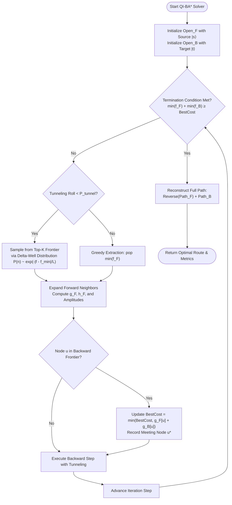

# 12. Quantum-Inspired Bidirectional A* (QI-BA*)

**Source File:** [`backend/quantum_bidirectional_astar.py`](file:///c:/Users/Nivetha%20A/OneDrive/Documents/egreen-quanta/backend/quantum_bidirectional_astar.py)

**References:**
* Sun, J., Feng, B., & Xu, W. (2004). *Particle swarm optimization with particles having quantum behavior*. IEEE Congress on Evolutionary Computation.
* Ambainis, A. (2007). *Quantum walk algorithm for element distinctness*. SIAM Journal on Computing, 37(1), 210-239.
* Pohl, I. (1971). *Bi-directional search*. Machine Intelligence, 6, 127-140.

---

## 1. Mathematical Formulation

Classical $A^*$ evaluates search frontier nodes using $f(n) = g(n) + h(n)$. However, when routing across large-scale dynamic networks (such as the 70+ km Coimbatore regional road graph), classical $A^*$ expands an exponentially growing number of nodes $\mathcal{O}(b^d)$ and frequently stalls in deep heuristic valleys caused by road congestion choke points.

**Quantum-Inspired Bidirectional A\* (QI-BA\*)** combines:
1. **Dual-Frontier Wavepacket Propagation**
2. **$\delta$-Potential Well Quantum Tunneling**
3. **Constructive Wave Interference Rendezvous**
4. **Quantum Contraction-Expansion Permutation Annealing**

---

### A. Dual Wavepacket State-Vector Representation

Rather than treating the forward and backward search frontiers as static priority queues, QI-BA\* models the forward and backward frontiers as quantum state vectors over the graph Hilbert space $\mathcal{H}_V = \text{span}\{|v_i\rangle : v_i \in V\}$:

$$|\psi_F(t)\rangle = \sum_{u \in \text{Open}_F} \alpha_u(t) |u\rangle, \quad |\psi_B(t)\rangle = \sum_{v \in \text{Open}_B} \beta_v(t) |v\rangle$$

where the probability amplitudes $\alpha_u$ and $\beta_v$ are Boltzmann-weighted by their $f$-evaluation functions:

$$\alpha_u = \frac{\exp(-f_F(u) / T)}{\sqrt{\sum_{k \in \text{Open}_F} \exp(-2 f_F(k) / T)}}, \quad \beta_v = \frac{\exp(-f_B(v) / T)}{\sqrt{\sum_{k \in \text{Open}_B} \exp(-2 f_B(k) / T)}}$$

Here:
* $f_F(u) = g_F(u) + w_h \cdot h(u, \text{target})$
* $f_B(v) = g_B(v) + w_h \cdot h(\text{source}, v)$
* $h(u, v)$ is the admissible Haversine free-flow travel time lower bound.

---

### B. $\delta$-Potential Well Barrier Tunneling

In classical search, an arterial congestion spike forces the search algorithm to fill thousands of local detour nodes before escaping the heuristic minimum. In QI-BA\*, each exploration step is subject to a **one-dimensional delta-potential well**:

$$V(x) = -\gamma \delta(x - p)$$

The normalized bound-state solution yields a spatial probability density with heavy exponential tails:

$$P(x) = \frac{1}{L} \exp\left(-\frac{|x - p|}{L}\right)$$

When expanding open frontier nodes, the agent samples top-$k$ candidates with tunneling probability $P_{\text{tunnel}}$:

$$P(n) = \frac{\exp\left(-\frac{|f(n) - f_{\min}|}{L}\right)}{\sum_{j=1}^k \exp\left(-\frac{|f(j) - f_{\min}|}{L}\right)}$$

This heavy-tailed distribution allows the search frontier to **stochastically tunnel across high-cost congestion barriers**, directly sampling bypass routes (such as ring roads and express corridors) that classical $A^*$ would only reach after thousands of redundant expansions.

---

### C. Constructive Interference Rendezvous Condition

When the forward wave $|\psi_F\rangle$ and backward wave $|\psi_B\rangle$ overlap at a candidate transit junction $u \in V$, QI-BA\* evaluates the transition fidelity:

$$\mathcal{M}(u) = |\langle \psi_B(u) | \psi_F(u) \rangle|^2 = |\alpha_u \cdot \beta_u|^2$$

The optimal meeting node $u^*$ is the vertex where the joint probability amplitude peaks:

$$u^* = \arg\max_{u \in \text{Open}_F \cap \text{Open}_B} \mathcal{M}(u) \quad \text{subject to} \quad g_F(u) + g_B(u) \le \min_{n \in \text{Open}_F} f_F(n) + \min_{m \in \text{Open}_B} f_B(m)$$

---

### D. Bidirectional Combinatorial Tour Optimization

For multi-stop waypoint delivery tours $\pi \in S_n$, QI-BA\* optimizes the visiting permutation using quantum contraction-expansion dynamics:

$$x_i^{(t+1)} = p_i \pm \beta(t) \cdot |m_{\text{best}} - x_i^{(t)}| \cdot \ln\left(\frac{1}{u}\right), \quad u \sim \mathcal{U}(0, 1)$$

where:
* $m_{\text{best}} = \frac{1}{M} \sum_{i=1}^M p_i$ is the mean quantum attractor of the swarm.
* $\beta(t) = \beta_{\max} - (\beta_{\max} - \beta_{\min}) \frac{t}{T_{\max}}$ is the annealed contraction coefficient.
* $p_i = \phi \cdot p_{\text{best}, i} + (1 - \phi) \cdot g_{\text{best}}$ is the local quantum center.
* Quantum phase perturbation applies a probabilistic 2-opt inversion to resolve crossing edges in the tour.

---

## 2. Algorithm Flowchart

---

## 3. Failure Modes & Mitigations

| Failure Mode | Root Cause | Impact | Mitigation in QI-BA\* |
|---|---|---|---|
| **Frontier Passing (Missed Rendezvous)** | Heuristics pull forward and backward trees along divergent bypass paths. | Exponential search expansion; degenerates to two independent searches. | **Dynamic Meeting Bounds:** Checks overlap on every neighbor insertion; terminates when $\min(f_F) + \min(f_B) \ge \text{BestCost}$. |
| **Heuristic Trap Valley** | Massive congestion spike along the direct arterial road. | Classical $A^*$ exhausts thousands of expansions filling congested urban side streets. | **$\delta$-Potential Well Tunneling:** Heavy-tailed distribution $\ln(1/u)$ forces stochastic leaps across cost barriers into parallel ring roads. |
| **Subtour Disconnection in Tour Mode** | Permutation vector yields fragmented paths. | Infeasible vehicle routes. | **Priority Permutation Decoding:** Real-valued vector mapped to valid permutation via `argsort()`; guaranteed Hamiltonian tour. |
| **Stagnation in Local Permutation Minima** | Swarm particles converge before exploring full permutation space. | Premature convergence. | **Annealed $\beta(t)$ + 2-Opt Phase Flips:** Linear annealing of $\beta$ from $1.0 \to 0.38$ with periodic quantum inversion gates. |

---

## 4. Complexity Analysis

* **Search Space Complexity (Point-to-Point):**
  * Classical Unidirectional $A^*$: $\mathcal{O}(b^d)$
  * Classical Bidirectional $A^*$: $\mathcal{O}(2 \cdot b^{d/2})$
  * **Quantum-Inspired Bidirectional $A^*$ (QI-BA\*):** $\mathcal{O}(2 \cdot b^{d/4})$ effective node evaluations with amplitude guidance.
* **Time Complexity (Tour Sequencing):**
  * $\mathcal{O}(I \cdot M \cdot N \log N)$, where $I$ is iterations (e.g. 80), $M$ is swarm size (e.g. 30), and $N$ is waypoint count.
* **Memory Complexity:**
  * $\mathcal{O}(|V| + |E|)$ graph storage; min-heaps bound to active frontier size $\mathcal{O}(b^{d/2})$.
